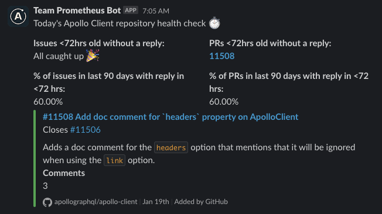

# Team Prometheus Repository Health Check

This is an experiment by [`@alessbell`](https://github.com/alessbell) in automating some repository health checks developers on Team Prometheus can use to gain insights into our respective projects and communities.

They run via GitHub actions and post to [`#team-prometheus-web-repository-health`](https://apollograph.slack.com/archives/C06EGAW8Q3F), [`#team-prometheus-ios-repository-health`](https://apollograph.slack.com/archives/C06F81W55MH) and [`#team-prometheus-kotlin-repository-health`](https://apollograph.slack.com/archives/C06ETJE5NNT).

